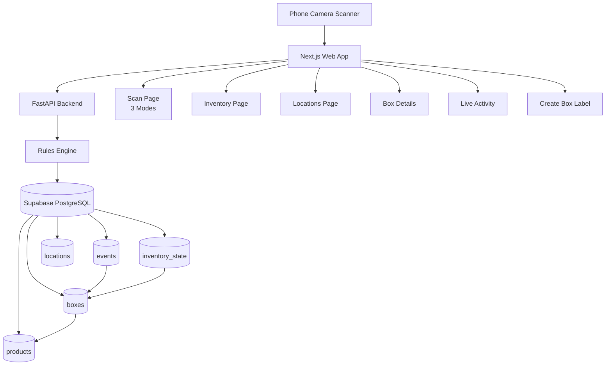

# Phone-Based Inventory + Location Tracking MVP

## Architecture Overview



## Database Schema (Supabase PostgreSQL)

### Table: `locations`

- `location_id` (UUID, PK, auto-generated)
- `location_code` (VARCHAR, UNIQUE) - stored WITHOUT prefix (e.g., "A3-R2-S4")
- `zone` (VARCHAR)
- `aisle` (VARCHAR)
- `rack` (VARCHAR)
- `shelf` (VARCHAR)
- `is_system_location` (BOOLEAN, default false) - true for RECEIVING
- `created_at` (TIMESTAMP, default now)
- Index on `location_code`

### Table: `events`

- `event_id` (UUID, PK, auto-generated)
- `client_event_id` (UUID, UNIQUE) - for idempotency
- `event_type` (VARCHAR: 'IN', 'OUT', 'MOVE')
- `box_id` (VARCHAR, NOT NULL, FK to boxes.box_id) - **Database FK constraint enforced**
- `location_id` (UUID, FK to locations, nullable)
- `timestamp` (TIMESTAMP, default now)
- `user_id` (VARCHAR, nullable)
- `mode` (VARCHAR: 'INBOUND', 'OUTBOUND', 'MOVE')
- `source_type` (VARCHAR: 'PHONE', 'INBOUND_STATION', 'OUTBOUND_STATION', 'API', default 'PHONE')
- `source_id` (VARCHAR, nullable) - optional device/station identifier
- `raw_qr_value` (TEXT, nullable, for debugging)
- `warning` (TEXT, nullable) - for OUT without IN warnings
- `exception_type` (VARCHAR, nullable) - 'OUT_WITHOUT_IN', 'MOVE_WHEN_OUT', 'DUPLICATE_SCAN'
- Index on `box_id`, `timestamp`, `client_event_id`, `exception_type`

### Table: `products`

- `product_id` (UUID, PK, auto-generated)
- `brand` (VARCHAR, NOT NULL)
- `name` (VARCHAR, NOT NULL)
- `size` (VARCHAR, nullable)
- `created_at` (TIMESTAMP, default now)
- Index on `brand`, `name`

### Table: `boxes`

- `box_id` (VARCHAR, PK) - stored WITHOUT prefix (e.g., "BX-20260109-000142")
- `product_id` (UUID, FK to products.product_id, NOT NULL) - **Database FK constraint enforced**
- `lot_code` (VARCHAR, nullable)
- `created_at` (TIMESTAMP, default now)
- `created_by` (VARCHAR, nullable)
- Index on `product_id`, `created_at`

### Table: `box_id_counters` (for race-free sequence generation)

- `date` (DATE, PK) - format: YYYY-MM-DD
- `last_seq` (INTEGER, NOT NULL, default 0) - last sequence number used for that date
- `updated_at` (TIMESTAMP, default now)
- Unique constraint on `date`

### Table: `inventory_state` (current snapshot)

- `box_id` (VARCHAR, PK, FK to boxes.box_id) - **Database FK constraint enforced**
- `status` (VARCHAR: 'IN_STOCK', 'OUT_OF_WAREHOUSE')
- `current_location_id` (UUID, FK to locations, nullable)
- `last_event_time` (TIMESTAMP)
- `last_event_type` (VARCHAR)
- Index on `status`, `current_location_id`

### Foreign Key Constraints (Database-Enforced)

- `events.box_id` → `boxes.box_id` (VARCHAR FK constraint)
- `inventory_state.box_id` → `boxes.box_id` (VARCHAR FK constraint)
- `boxes.product_id` → `products.product_id` (UUID FK constraint)
- `events.location_id` → `locations.location_id` (UUID FK constraint)
- `inventory_state.current_location_id` → `locations.location_id` (UUID FK constraint)

**Rationale**: Database FK constraints prevent silent data corruption. Application-level validation is insufficient for warehouse systems where data integrity is critical.

## Backend API (FastAPI)

### Project Structure

```
backend/
├── app/
│   ├── __init__.py
│   ├── main.py              # FastAPI app entry
│   ├── database.py          # Supabase connection
│   ├── models.py            # Pydantic models
│   ├── schemas.py           # Database schemas (SQLAlchemy/supabase-py)
│   ├── rules_engine.py      # Business rules (T1, T2, T3)
│   ├── routers/
│   │   ├── __init__.py
│   │   ├── events.py        # POST /events
│   │   ├── inventory.py     # GET /inventory
│   │   ├── boxes.py         # GET /boxes/:box_id, POST /boxes
│   │   ├── locations.py     # GET/POST /locations
│   │   └── products.py      # GET /products, POST /products
│   └── utils/
│       └── qr_generator.py  # Generate location QR codes
├── requirements.txt
└── .env.example
```

### Endpoints

**POST /events**

- Request body variants:
  - INBOUND: `{ "client_event_id": "uuid", "event_type": "IN", "box_id": "BX-20260109-000142", "mode": "INBOUND", "source_type": "PHONE" }`
  - OUTBOUND: `{ "client_event_id": "uuid", "event_type": "OUT", "box_id": "BX-20260109-000142", "mode": "OUTBOUND", "source_type": "PHONE" }`
  - MOVE: `{ "client_event_id": "uuid", "event_type": "MOVE", "box_id": "BX-20260109-000142", "location_code": "A3-R2-S4", "mode": "MOVE", "source_type": "PHONE" }`
- Box validation:
  - Strip `BOX:` prefix from box_id if present
  - Database FK constraint enforces box_id exists in `boxes` table
  - If box_id does not exist: database will reject with FK violation, return 400 with message "Unknown box. Create label first."
- Location code handling:
  - If location_code provided, strip `LOC:` prefix if present
  - Look up location by `location_code` (stored without prefix in DB)
- Idempotency:
  - Check if `client_event_id` already exists
  - If exists, return existing event with product info (joined from boxes → products)
- Rules enforcement:
  - T1: Validate mode matches event_type
  - T2: MOVE requires location_code
  - T3: 
    - MOVE only if box status = IN_STOCK (reject if OUT_OF_WAREHOUSE, set exception_type: 'MOVE_WHEN_OUT')
    - OUT without IN history: allow but set `exception_type: 'OUT_WITHOUT_IN'` and warning message
    - IN sets location to RECEIVING (system location) if not already set
- Actions:
  - Insert into `events` table with exception_type if applicable (or return existing if duplicate)
  - Update `inventory_state` table
  - Join with `boxes` → `products` to get product info (not stored in events, normalized)
- Response includes product info (from join, not duplicated):
```json
{
  "event_id": "...",
  "success": true,
  "message": "...",
  "warning": "Box was never received (no IN event found)",
  "exception_type": "OUT_WITHOUT_IN",
  "is_duplicate": false,
  "box_id": "BX-20260109-000142",
  "product": {
    "brand": "Jack Daniels",
    "name": "Tennessee Whiskey",
    "size": "750ml"
  },
  "lot_code": "L2026-01"
}
```


**POST /products**

- Request: `{ "brand": "Jack Daniels", "name": "Tennessee Whiskey", "size": "750ml" }`
- Response: `{ "product_id": "<uuid>", "brand": "...", "name": "...", "size": "..." }`

**GET /products**

- Returns: List of all products for dropdown/search
- Response: `[{ "product_id": "...", "brand": "...", "name": "...", "size": "..." }, ...]`

**POST /boxes** (Generate Box Label - Race-Safe)

- Request: `{ "product_id": "<uuid>", "lot_code": "L2026-01" }` (lot_code optional)
- Backend actions (in single transaction):

  1. Get current date: YYYYMMDD (e.g., 20260109)
  2. Lock `box_id_counters` row for today (SELECT FOR UPDATE)
  3. Increment `last_seq`, return new sequence number
  4. Generate box_id: `BX-YYYYMMDD-######` where ###### = 6-digit padded sequence
  5. Insert into `boxes` table with generated box_id
  6. Commit transaction

- This prevents race conditions when multiple users generate boxes simultaneously
- Response:
```json
{
  "box_id": "BX-20260109-000142",
  "qr_value": "BOX:BX-20260109-000142",
  "product": {
    "brand": "Jack Daniels",
    "name": "Tennessee Whiskey",
    "size": "750ml"
  },
  "lot_code": "L2026-01"
}
```

- Note: Database stores `box_id` without prefix, QR encodes `BOX:<box_id>`

- Note: Frontend generates QR image from `qr_value` string

**GET /inventory**

- Query params: `?status=IN_STOCK&location_id=...&search=BOX123`
- Returns: List of boxes with current state, location info, and product info
- Response includes: `box_id`, `status`, `current_location`, `last_event_time`, `product` (brand, name, size), `lot_code`
- Product info joined from `products` table via `boxes.product_id` (normalized, not duplicated)

**GET /boxes/{box_id}**

- Returns: Current state + full event history for box + product info
- Response includes: `box_id`, `product` (brand, name, size), `lot_code`, `status`, `current_location`, `events` (array)
- Product info joined from `products` table (normalized, not stored in events)

**GET /exceptions** (NEW - MVP Exception View)

- Query params: `?exception_type=OUT_WITHOUT_IN&limit=100`
- Returns: List of events with exceptions/warnings
- Response includes: `event_id`, `timestamp`, `box_id`, `event_type`, `exception_type`, `warning`, `product` (from join)
- Used by Exceptions page or filtered Activity feed

**GET /locations**

- Returns: All locations with zone/aisle/rack/shelf info
- Filter system locations separately (RECEIVING should be marked `is_system_location: true`)

**POST /locations**

- Request: `{ "zone": "A", "aisle": "3", "rack": "R2", "shelf": "S4" }`
- Backend generates unique `location_code`: Format `{ZONE}{AISLE}-{RACK}-{SHELF}` (e.g., "A3-R2-S4")
- Validation: Cannot create/edit system locations via API (RECEIVING is locked)
- Returns: Location object with `location_code` (without prefix)
- Note: QR code encodes `LOC:<location_code>` but database stores location_code without prefix

**GET /locations**

- Returns: All locations with zone/aisle/rack/shelf info

**POST /locations**

- Request: `{ "zone": "A", "aisle": "1", "rack": "R1", "shelf": "S2" }`
- Backend generates unique `location_code`
- Returns: Location object + QR code image data

## Frontend (Next.js)

### Project Structure

```
frontend/
├── app/
│   ├── layout.tsx
│   ├── page.tsx              # Landing/redirect
│   ├── scan/
│   │   └── page.tsx          # Scan screen with mode selector
│   ├── inventory/
│   │   └── page.tsx          # Inventory list with search/filter
│   ├── locations/
│   │   └── page.tsx          # Browse locations
│   ├── boxes/
│   │   └── [box_id]/
│   │       └── page.tsx      # Box details + history
│   ├── create-box/
│   │   └── page.tsx          # Create box label page
│   ├── exceptions/
│   │   └── page.tsx          # Exceptions view (OUT_WITHOUT_IN, etc.)
│   └── activity/
│       └── page.tsx          # Live activity feed with exception filter
├── components/
│   ├── QRScanner.tsx         # QR code scanner component
│   ├── ModeSelector.tsx      # INBOUND/OUTBOUND/MOVE selector
│   ├── LocationQRDisplay.tsx # Admin: Show QR for printing
│   ├── BoxLabelPrint.tsx     # Printable box label component
│   ├── InventoryTable.tsx    # Inventory list component
│   └── EventTimeline.tsx     # Box history timeline
├── lib/
│   ├── api.ts                # API client functions
│   └── types.ts              # TypeScript types
├── package.json
└── next.config.js
```

### Key Components

**Scan Page (`/scan`)**

- Mode selector: Radio buttons or tabs for INBOUND/OUTBOUND/MOVE
- QR scanner component (html5-qrcode or zxing-js)
- **State management for MOVE mode**:
  - `pendingLocation`: Stores location_code after Step 1 scan
  - `currentStep`: 1 or 2 (locked after Step 1)
  - Location card display: "Location locked: `<location_code>`" with Clear button
  - Clear button resets to Step 1 and clears `pendingLocation`
- **MOVE mode flow**:
  - Step 1: "Scan Location QR" 
    - Only accepts QR codes with `LOC:` prefix
    - Extract location_code (strip `LOC:` prefix)
    - Validate location exists (optional: check with backend)
    - Store in `pendingLocation`, lock UI to Step 2
    - Show location card with Clear button
  - Step 2: "Scan Box QR"
    - Only accepts QR codes with `BOX:` prefix
    - Extract box_id (strip `BOX:` prefix)
    - Call POST /events with `event_type=MOVE`, `box_id`, `location_code` from `pendingLocation`
    - On success: Reset to Step 1, clear `pendingLocation`
- **INBOUND/OUTBOUND mode**:
  - Single scan, only accepts `BOX:` prefix
  - Extract box_id (strip `BOX:` prefix)
  - Immediate submit with POST /events
  - After successful response, display product info prominently:
    - Large text: `<brand> - <name>`
    - Size and lot_code (if available) below
    - Show in success card/toast
- **QR type validation**:
  - Validate prefix before processing (`LOC:` or `BOX:`)
  - Show clear error toast if wrong QR type scanned
  - Toast message: "Invalid QR type. Expected LOC: for location or BOX: for box"
  - If box_id not found: Show error "Unknown box. Create label first."
- **Scan feedback**:
  - Success: Beep sound + vibration (if supported)
  - Error: Distinct error sound (no vibration)
  - Visual feedback: Green flash on success, red flash on error
- Success/error toast notifications with warning support
- Product display after scan: Show brand/product name prominently in response UI

**Create Box Label Page (`/create-box`)**

- Load products from GET /products
- Product picker: Searchable dropdown/combobox showing `brand - name - size`
- Lot code input: Optional text field
- "Generate Box Label" button:
  - Calls POST /boxes with selected product_id and lot_code
  - On success, display printable label card
- Printable label display:
  - Large text: `BRAND + PRODUCT NAME` (prominent)
  - Size and Lot code (if provided) below
  - Box ID text: `Box ID: BX-20260109-000142`
  - QR code image: Generated from `qr_value` using frontend QR library
  - Print button: Uses `window.print()` to print label
- Label styling: Optimized for 4x6 label printer (CSS @media print)

**Inventory Page (`/inventory`)**

- Search bar (box_id, brand, or product name)
- Filter dropdowns (status, location, product/brand)
- Table showing: 
  - box_id
  - Product: `brand - name - size`
  - lot_code (if available)
  - status
  - current_location
  - last_event_time
- Link to box details page

**Locations Page (`/locations`)**

- Grid/list of all locations
- Click location to see boxes currently there
- Admin: "Create Location" button

**Box Details Page (`/boxes/[box_id]`)**

- Product info card:
  - Brand (large, prominent)
  - Product name
  - Size
  - Lot code (if available)
- Current status card
- Current location card
- Event timeline (chronological list) with product info preserved

**Exceptions Page (`/exceptions`)**

- Filter by exception_type: OUT_WITHOUT_IN, MOVE_WHEN_OUT, DUPLICATE_SCAN
- Shows events with exceptions/warnings
- Display: timestamp, box_id, product (brand/name), event_type, exception_type, warning message
- Link to box details page
- Purpose: Make exceptions visible and actionable

**Live Activity Page (`/activity`)**

- Recent 100 events feed
- Auto-refresh or manual refresh button
- Filter toggle: "Show exceptions only"
- Shows: timestamp, box_id, product (brand/name), event_type, mode, location, exception_type (if any)
- Exception events highlighted (yellow/orange badge)

**QR Scanner Component**

- Use `html5-qrcode` library
- Mobile-first camera view
- **Client-side scan cooldown**: 
  - Track last scanned value and timestamp
  - If same QR value detected within 1500ms, ignore (prevent repeat triggers)
  - Store in component state: `{ lastScanned: string, lastTimestamp: number }`
- **QR prefix validation**:
  - Accept `expectedPrefix` prop ('LOC:' or 'BOX:' or null for both)
  - Validate scanned QR starts with expected prefix
  - Return parsed value (without prefix) on success
  - Return error if prefix doesn't match
- Handle scan success/error callbacks
- **Audio/Feedback**:
  - Success: Play beep sound (HTML5 Audio or Web Audio API)
  - Success: Vibration API (`navigator.vibrate(200)`) if supported
  - Error: Play distinct error sound (different pitch/length)
  - Visual feedback: Flash overlay (green success, red error)
- Error handling for camera permissions and unsupported browsers

## Database Seeding

### Seed RECEIVING Location

- Create seed migration: `002_seed_receiving_location.sql`
- Insert location with:
  - `location_code`: `RECEIVING` (stored without prefix)
  - `zone`: `RECEIVING`
  - `aisle`: `N/A`
  - `rack`: `N/A`
  - `shelf`: `N/A`
  - `is_system_location`: `true`
- Used as default location for IN events
- System location protection:
  - Cannot be deleted via API (backend validation)
  - Cannot be edited (zone/aisle/rack/shelf locked)
  - Filtered separately in UI (marked as system location)
- QR code encodes: `LOC:RECEIVING` (prefix added when generating QR, not stored in DB)

## QR Code Format & Validation

### QR Code Format Standardization

**Database Storage (no prefix)**:

- `locations.location_code`: Stores `A3-R2-S4` or `RECEIVING` (no prefix)
- `boxes.box_id`: Stores `BX-20260109-000142` (no prefix)

**QR Code Encoding (with prefix)**:

- Location QR: Encodes `LOC:<location_code>` (e.g., `LOC:A3-R2-S4`, `LOC:RECEIVING`)
- Box QR: Encodes `BOX:<box_id>` (e.g., `BOX:BX-20260109-000142`)

**Validation Rules (Frontend)**:

- MOVE Step 1: Accept only QR codes starting with `LOC:`, strip prefix, lookup by location_code
- MOVE Step 2: Accept only QR codes starting with `BOX:`, strip prefix, use box_id
- INBOUND/OUTBOUND: Accept only QR codes starting with `BOX:`, strip prefix, use box_id
- Strip prefix before sending to backend (backend receives clean values)

**Consistency**: Database stores normalized values without prefixes. Prefixes are added only when generating QR codes and stripped when scanning.

## Rules Engine Implementation

**Rule T1 (Truth)**: IN/OUT events only allowed in INBOUND/OUTBOUND mode

- Validation in `POST /events` endpoint

**Rule T2 (Location)**: MOVE requires location_code first, then box_id

- Frontend handles two-step flow with state management
- Backend validates location_code exists

**Rule T3 (Consistency)**:

- **IN**: Set status = IN_STOCK, set `current_location_id` to RECEIVING (LOC_RECEIVING) if not already set
- **OUT**: Set status = OUT_OF_WAREHOUSE, clear `current_location_id` (set to null)
  - If box has no IN event history, allow but return warning in response
- **MOVE**: Only allow if current status = IN_STOCK (reject with user-friendly error if OUT_OF_WAREHOUSE)

**Idempotency Rule**:

- Frontend generates `client_event_id` (UUID) for each POST /events
- Backend stores `client_event_id` with UNIQUE constraint
- If duplicate `client_event_id` received, return existing event without creating new one

## QR Code Generation (Admin & Box Labels)

### Location QR Generation (Admin)

- Admin creates location via form (Zone/Aisle/Rack/Shelf)
- Backend generates unique `location_code`: Format `{ZONE}{AISLE}-{RACK}-{SHELF}` (e.g., `A3-R2-S4`)
- Database stores `location_code` without prefix: `A3-R2-S4`
- Frontend generates QR image encoding: `LOC:A3-R2-S4` (prefix added in QR only)
- Display QR code on screen for printing
- System locations (RECEIVING) cannot be deleted/edited via API

### Box QR Generation (System-Generated, Race-Safe)

- Backend generates box_id on POST /boxes using `box_id_counters` table
  - Format: `BX-YYYYMMDD-######`
  - YYYYMMDD = current date (e.g., 20260109)
  - ###### = 6-digit daily sequence (e.g., 000142)
  - Sequence managed in `box_id_counters` table with row-level locking (SELECT FOR UPDATE)
  - Transaction-safe: prevents duplicate box_id when multiple users generate simultaneously
- Database stores `box_id` without prefix: `BX-20260109-000142`
- Backend returns `qr_value`: `BOX:BX-20260109-000142` (prefix added in response for QR generation)
- Frontend generates QR image using JS library from `qr_value` string
- QR image is part of printable box label

## Dependencies

### Backend (requirements.txt)

- fastapi
- uvicorn
- supabase (Python client)
- pydantic
- python-dotenv
- qrcode[pil] (for QR generation)

### Frontend (package.json)

- next
- react
- html5-qrcode (or zxing-js)
- axios or fetch (API calls)
- tailwindcss (styling, recommended)
- react-hot-toast (toast notifications)
- uuid (for generating client_event_id)
- qrcode.react (for generating QR code images on frontend)
- react-select (for searchable product dropdown)

## Deployment

- Frontend: Vercel (Next.js)
- Backend: Render/Railway/Fly.io (FastAPI)
- Database: Supabase (PostgreSQL)

## Key Files to Create

1. `backend/app/main.py` - FastAPI app with CORS, routers
2. `backend/app/database.py` - Supabase client initialization
3. `backend/app/routers/events.py` - Event creation with rules
4. `backend/app/rules_engine.py` - Business rules validation
5. `backend/supabase/migrations/001_initial_schema.sql` - Database schema (includes products, boxes, box_id_counters, FK constraints)
6. `backend/supabase/migrations/002_seed_receiving_location.sql` - Seed RECEIVING location (is_system_location: true)
7. `backend/app/routers/products.py` - POST /products, GET /products
8. `backend/app/routers/boxes.py` - POST /boxes (generate label, race-safe), GET /boxes/{box_id} (updated)
9. `backend/app/routers/exceptions.py` - GET /exceptions (exception view)
10. `backend/app/utils/box_id_generator.py` - Box ID generation logic (transaction-safe with box_id_counters table)
11. `frontend/app/create-box/page.tsx` - Create box label page with product picker
12. `frontend/components/BoxLabelPrint.tsx` - Printable box label component
13. `frontend/components/QRCodeDisplay.tsx` - QR code image generator component
14. `frontend/app/scan/page.tsx` - Scan page with mode selector, MOVE two-step flow, product display
15. `frontend/components/QRScanner.tsx` - Reusable QR scanner with cooldown and prefix validation
16. `frontend/lib/api.ts` - API client functions with client_event_id generation, product/box endpoints
17. `frontend/lib/feedback.ts` - Audio/vibration feedback utilities

## Implementation Details

### MOVE Mode Two-Step UI Implementation

**State Variables**:

```typescript
const [mode, setMode] = useState<'INBOUND' | 'OUTBOUND' | 'MOVE'>('INBOUND');
const [pendingLocation, setPendingLocation] = useState<string | null>(null);
const [moveStep, setMoveStep] = useState<1 | 2>(1);
```

**Location Card Component** (shown when `pendingLocation` is set):

- Display: "Location locked: `<location_code>`"
- Clear button: Resets `pendingLocation` and `moveStep` to 1

**Step Flow**:

1. User selects MOVE mode → Reset to Step 1
2. Step 1: Scanner accepts only `LOC:` prefix
3. On valid scan: Set `pendingLocation`, set `moveStep` to 2, show location card
4. Step 2: Scanner accepts only `BOX:` prefix
5. On valid scan: Submit event with both `box_id` and `location_code`
6. On success: Reset `pendingLocation`, set `moveStep` to 1

### QR Prefix Validation Logic

**QR Scanner Component**:

```typescript
interface QRScannerProps {
  expectedPrefix?: 'LOC:' | 'BOX:' | null; // null = accept both
  onScanSuccess: (value: string) => void;
  onScanError: (error: string) => void;
}
```

**Validation Function**:

- Check if scanned value starts with expected prefix
- If yes: Strip prefix and return value
- If no: Call `onScanError` with user-friendly message

### Client-Side Scan Cooldown

**Implementation**:

```typescript
const [lastScanned, setLastScanned] = useState<{value: string, timestamp: number} | null>(null);

const handleScan = (scannedValue: string) => {
  const now = Date.now();
  if (lastScanned && lastScanned.value === scannedValue && (now - lastScanned.timestamp) < 1500) {
    return; // Ignore duplicate scan
  }
  setLastScanned({ value: scannedValue, timestamp: now });
  // Process scan...
};
```

### Idempotency Implementation

**Frontend** (generate UUID for each request):

```typescript
import { v4 as uuidv4 } from 'uuid';

const createEvent = async (eventData) => {
  const clientEventId = uuidv4();
  return await api.post('/events', { ...eventData, client_event_id: clientEventId });
};
```

**Backend** (check for duplicate):

```python
# In POST /events endpoint
existing_event = db.query("SELECT * FROM events WHERE client_event_id = $1", [client_event_id])
if existing_event:
    return {"event_id": existing_event["event_id"], "is_duplicate": True, ...}
```

### Error Handling

**OUT without IN**:

- Backend checks if box has any IN event in history
- If no IN found: Allow OUT, but return `warning: "Box was never received (no IN event found)"`
- Frontend displays warning in toast (yellow/orange)

**MOVE when OUT**:

- Backend checks `inventory_state.status`
- If `OUT_OF_WAREHOUSE`: Return 400 error with message `"Cannot move box that is out of warehouse. Please receive box first (INBOUND mode)."`
- Frontend shows error toast (red)

### Scan Feedback Implementation

**Audio Feedback**:

```typescript
// lib/feedback.ts
export const playSuccessBeep = () => {
  const audio = new Audio('/sounds/success-beep.mp3'); // 200ms, 800Hz
  audio.play();
};

export const playErrorBeep = () => {
  const audio = new Audio('/sounds/error-beep.mp3'); // 300ms, 400Hz
  audio.play();
};
```

**Vibration Feedback**:

```typescript
export const vibrateSuccess = () => {
  if ('vibrate' in navigator) {
    navigator.vibrate(200); // Short vibration
  }
};
```

**Visual Feedback**:

- Flash overlay component (CSS animation)
- Green overlay for success (300ms fade)
- Red overlay for error (300ms fade)

## Implementation Details

### Box ID Generation (Backend - Race-Safe)

**Transaction-Safe Daily Sequence Logic**:

```python
from datetime import datetime
import psycopg2.extras

def generate_box_id(db_conn) -> str:
    today = datetime.now().date()
    today_str = today.strftime("%Y%m%d")
    
    with db_conn.cursor() as cur:
        # Start transaction
        db_conn.begin()
        try:
            # Lock row for update (prevents race condition)
            cur.execute("""
                SELECT last_seq FROM box_id_counters 
                WHERE date = %s 
                FOR UPDATE
            """, (today,))
            
            row = cur.fetchone()
            if row:
                next_seq = row[0] + 1
                cur.execute("""
                    UPDATE box_id_counters 
                    SET last_seq = %s, updated_at = NOW() 
                    WHERE date = %s
                """, (next_seq, today))
            else:
                next_seq = 1
                cur.execute("""
                    INSERT INTO box_id_counters (date, last_seq) 
                    VALUES (%s, %s)
                """, (today, next_seq))
            
            db_conn.commit()
            return f"BX-{today_str}-{next_seq:06d}"  # 6 digits, zero-padded
        except Exception as e:
            db_conn.rollback()
            raise
```

**Why this works**: `SELECT FOR UPDATE` locks the counter row until transaction commits, preventing concurrent requests from getting the same sequence number.

### Box Validation in POST /events

**Implementation**:

```python
# In POST /events endpoint
box_id = event_data.box_id
if box_id.startswith("BOX:"):
    box_id = box_id[4:]  # Strip prefix

# Database FK constraint automatically enforces box_id exists in boxes table
# If box_id doesn't exist, insert will fail with FK violation
try:
    # Insert event (FK constraint validates box_id)
    event = db.execute("""
        INSERT INTO events (box_id, event_type, ...) 
        VALUES ($1, $2, ...)
        RETURNING *
    """, [box_id, event_type])
except ForeignKeyViolation:
    raise HTTPException(400, "Unknown box. Create label first.")

# Join with products for response (normalized, not duplicated)
product_info = db.query("""
    SELECT p.brand, p.name, p.size, b.lot_code
    FROM boxes b
    JOIN products p ON b.product_id = p.product_id
    WHERE b.box_id = $1
""", [box_id])
```

**Key Point**: Database FK constraint provides enforcement. Application code handles the error gracefully.

### QR Image Generation (Frontend)

**Using qrcode.react**:

```typescript
import { QRCodeSVG } from 'qrcode.react';

<QRCodeSVG 
  value={qrValue} // e.g., "BOX:BX-20260109-000142"
  size={256}
  level="H" // High error correction
/>
```

### Printable Box Label Component

**Styling for Print**:

```css
@media print {
  @page {
    size: 4in 6in; /* 4x6 label */
    margin: 0.25in;
  }
  .no-print {
    display: none; /* Hide buttons, navigation */
  }
}
```

**Label Layout**:

- Top: Large brand + product name (24pt bold)
- Middle: Size + Lot code (if available) (14pt)
- Bottom left: Box ID text (12pt)
- Bottom right: QR code (256x256px)

## Acceptance Criteria

✅ Can create products via POST /products

✅ Can generate box label with system-created box_id (BX-YYYYMMDD-###### format)

✅ Box QR codes encode "BOX:<box_id>" format

✅ Scanning a box in INBOUND/OUTBOUND/MOVE works only if box_id exists in boxes table

✅ Unknown box_id returns 400 error: "Unknown box. Create label first."

✅ Every scan result (POST /events response) shows brand/product name (and size/lot if available)

✅ Scan page displays product info prominently after successful scan

✅ Shelf QRs remain permanent with "LOC:<location_code>" and are used in MOVE Step 1

✅ Inventory list shows product info (brand/name/size) for each box

✅ Box details page shows product info + lot_code

✅ Printable box label displays correctly for 4x6 labels

## Security & Permissions (MVP-Level)

### Basic Authentication

- Add simple login system (email/password or basic auth)
- JWT tokens for API authentication
- Two roles:
  - **Operator**: Can scan (IN/OUT/MOVE), view inventory, view boxes
  - **Admin**: Can create products, create boxes, create locations, view exceptions

### Implementation Notes

- Use Supabase Auth or simple JWT-based auth
- Protect endpoints: POST /products, POST /boxes, POST /locations require admin role
- User context passed via JWT: `user_id`, `role`
- MVP can use simple role check; upgrade to full RBAC later

## Implementation Notes

### Data Integrity

- Database FK constraints enforced on all foreign keys (prevents silent corruption)
- Box ID generation uses transaction-safe counter table (prevents race conditions)
- Exception tracking via `exception_type` field (makes issues visible)
- Product info normalized (joined, not duplicated in events)

### Operational Requirements

- Exceptions page/view: Makes OUT_WITHOUT_IN and other issues visible
- System locations (RECEIVING) protected from deletion/editing
- Source tracking: `source_type` field enables future conveyor/camera integration

### Technical

- Use Supabase Row Level Security (RLS) for production (disabled for MVP, enabled later)
- Handle camera permissions gracefully on mobile
- Add loading states for all API calls
- Implement error boundaries in React
- Test cooldown mechanism to prevent accidental double scans
- Ensure RECEIVING location is seeded before first IN event
- Box ID sequence resets daily (test timezone handling)
- QR code images generated client-side (no backend image generation needed)
- Product dropdown should be searchable/filterable for large catalogs
- Location code format: Database stores without prefix, QR adds prefix

### Future Upgrades (Post-MVP)

- Bulk box creation: "Generate 20 labels for product X + lot Y" → PDF/list of QRs
- WebSocket live updates for activity feed
- Full RBAC (role-based access control) beyond operator/admin
- Integration with inbound/outbound stations (use existing `source_type` field)